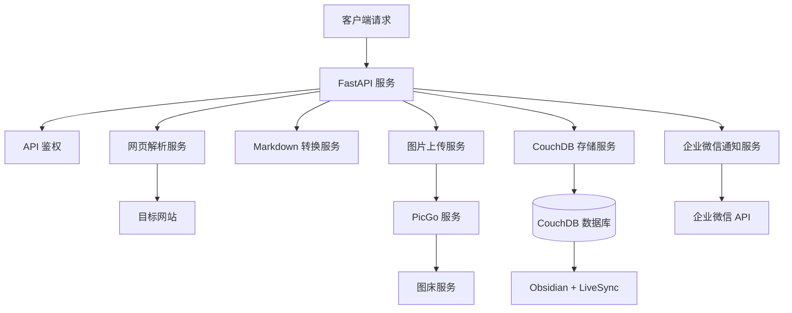
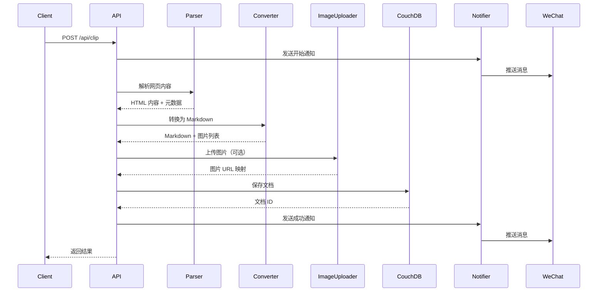

# 系统架构文档

本文档详细介绍 Obsidian 剪藏 API 的系统架构、设计理念和核心组件。

## 架构概览

Obsidian 剪藏 API 采用微服务架构设计，由多个专门的服务组件组成，每个组件负责特定的功能领域。



## 核心设计理念

### 1. 高内聚、低耦合

- **模块化设计**: 每个服务组件都有明确的职责边界
- **接口标准化**: 组件间通过标准化接口通信
- **可替换性**: 各组件可以独立替换和升级

### 2. 异步处理

- **非阻塞 I/O**: 使用 FastAPI 的异步特性处理并发请求
- **异步上传**: 图片上传采用异步方式，提高处理效率
- **消息通知**: 通知服务异步执行，不阻塞主流程

### 3. 容错设计

- **异常处理**: 每个组件都有完善的异常处理机制
- **降级策略**: 非关键功能失败时，主流程仍能正常执行
- **重试机制**: 网络请求和文件操作支持重试

## 项目结构

```
obsidian-clip-api-couchdb/
├── app/                          # 应用主目录
│   ├── main.py                  # FastAPI 应用入口
│   ├── config.py                # 配置管理
│   ├── api/                     # API 路由层
│   │   └── routes.py           # 路由定义和请求处理
│   └── services/               # 业务服务层
│       ├── web_parser.py       # 网页解析服务
│       ├── markdown_converter.py  # Markdown 转换服务
│       ├── image_uploader.py   # 图片上传服务
│       ├── couchdb_service.py  # CouchDB 存储服务
│       └── notification.py     # 通知服务
├── tests/                      # 测试目录
├── debug/                      # 调试文件输出
├── docs/                       # 项目文档
├── config.yaml.example        # 配置文件模板
├── requirements.txt            # Python 依赖
├── Dockerfile                  # Docker 构建文件
└── docker-compose.yml         # Docker Compose 配置
```

## 核心组件详解

### 1. API 路由层 (`app/api/routes.py`)

**职责**: 处理 HTTP 请求、参数验证、响应格式化

**关键功能**:
- API 鉴权验证
- 请求参数校验
- YAML front matter 生成
- 错误处理和响应

**设计模式**: 
- **依赖注入**: 使用 FastAPI 的依赖注入系统
- **中间件模式**: API 鉴权通过中间件实现

```python
@router.post("/clip", response_model=ClipResponse)
async def clip_article(
    request: ClipRequest,
    verified: bool = Depends(verify_api_key)
):
    # 业务逻辑处理
```

### 2. 网页解析服务 (`app/services/web_parser.py`)

**职责**: 获取网页内容并进行预处理

**核心算法**:
1. **智能内容提取**: 结合 trafilatura 和自定义规则
2. **标题提取策略**: 优先级 `og:title` > `title` > `h1`
3. **元数据提取**: 作者、发布时间、描述信息
4. **内容清理**: 移除广告、导航等无关内容

**技术特点**:
- **多策略提取**: 支持多种内容提取策略
- **调试支持**: 可配置的调试文件输出
- **容错处理**: 网络请求失败时的降级策略

```python
def parse_url(self, url: str) -> Tuple[str, str, str, dict]:
    """
    返回: (title, original_html, cleaned_html, meta_info)
    """
```

### 3. Markdown 转换服务 (`app/services/markdown_converter.py`)

**职责**: 将 HTML 内容转换为高质量的 Markdown

**转换流程**:
1. **HTML 预处理**: 清理和优化 HTML 结构
2. **Markdown 转换**: 使用 markdownify 进行基础转换
3. **图片提取**: 提取图片 URL 并建立映射
4. **格式优化**: 优化 Markdown 格式和结构

**技术实现**:
- **自定义转换器**: 针对特定标签的自定义处理
- **图片映射**: 维护原始 URL 与本地引用的映射关系
- **格式标准化**: 确保输出符合 Obsidian 规范

### 4. 图片上传服务 (`app/services/image_uploader.py`)

**职责**: 处理图片上传到图床并替换 URL

**工作流程**:
1. **图片下载**: 从原始网页下载图片
2. **格式验证**: 验证图片格式和大小
3. **图床上传**: 通过 PicGo API 上传到图床
4. **URL 替换**: 在 Markdown 中替换为图床 URL

**特性**:
- **异步上传**: 支持并发上传多张图片
- **错误处理**: 单张图片失败不影响整体流程
- **缓存机制**: 避免重复上传相同图片

```python
async def upload_images(self, images: List[str]) -> Dict[str, str]:
    """
    返回: {原始URL: 图床URL} 的映射字典
    """
```

### 5. CouchDB 存储服务 (`app/services/couchdb_service.py`)

**职责**: 与 CouchDB 交互，存储剪藏文档

**存储模型**:
- **双文档结构**: 
  - **叶子文档**: 存储实际内容
  - **父文档**: 存储文件元数据和路径信息
- **时间戳管理**: 创建时间、修改时间的精确控制
- **路径规范**: 支持自定义文件夹结构

**兼容性设计**:
- **LiveSync 协议**: 完全兼容 Obsidian LiveSync 插件
- **文档 ID 生成**: 基于时间戳和内容的唯一 ID
- **版本控制**: 支持文档版本管理

### 6. 企业微信通知服务 (`app/services/notification.py`)

**职责**: 发送剪藏状态通知到企业微信

**通知类型**:
- **开始通知**: 包含时间、链接、图床状态
- **进度通知**: 中间处理步骤的状态更新
- **成功通知**: 包含标题、路径等结果信息
- **错误通知**: 详细的错误信息和堆栈跟踪

**消息格式**:
```
📥 开始剪藏
时间：2024-03-06 15:30:25
链接：https://example.com
图床：已开启
```

## 数据流设计

### 剪藏流程



### 配置管理

配置系统采用层级设计：

```yaml
# 配置文件结构
name: string                  # 服务名称
version: string              # 版本信息
host: string                 # 监听地址
port: integer               # 监听端口

api:                        # API 配置
  enabled: boolean          # 是否启用鉴权
  key: string              # API 密钥

couchdb:                    # 数据库配置
  url: string              # 连接 URL
  db_name: string          # 数据库名称

picgo:                      # 图床配置
  enabled: boolean         # 是否启用
  server: string          # PicGo 服务地址
  upload_path: string     # 上传路径

work_wechat:               # 企业微信配置
  corp_id: string         # 企业 ID
  agent_id: string        # 应用 ID
  corp_secret: string     # 应用密钥
  at_all: boolean         # 是否 @所有人

obsidian:                  # Obsidian 配置
  clippings_path: string  # 保存路径

debug: boolean             # 调试模式
```

## 性能优化策略

### 1. 异步处理

- **并发请求**: FastAPI 原生支持异步处理
- **图片上传**: 多张图片并发上传
- **非阻塞通知**: 消息通知不阻塞主流程

### 2. 缓存机制

- **配置缓存**: 配置信息内存缓存
- **图片缓存**: 避免重复上传相同图片
- **连接池**: CouchDB 连接复用

### 3. 资源管理

- **内存控制**: 大文件分块处理
- **连接管理**: 及时释放网络连接
- **临时文件**: 自动清理临时文件

## 扩展性设计

### 1. 服务扩展

- **图床支持**: 可轻松添加新的图床服务
- **通知渠道**: 支持添加其他通知方式
- **存储后端**: 可扩展支持其他数据库

### 2. API 扩展

- **批量处理**: 支持批量剪藏多个 URL
- **自定义格式**: 支持自定义输出格式
- **插件系统**: 预留插件接口

### 3. 部署扩展

- **水平扩展**: 支持多实例部署
- **负载均衡**: 可配合负载均衡器使用
- **监控集成**: 预留监控和日志接口

## 安全性设计

### 1. API 安全

- **密钥验证**: 支持 API Key 鉴权
- **CORS 控制**: 可配置跨域访问策略
- **请求限制**: 预留请求频率限制接口

### 2. 数据安全

- **敏感信息**: 配置文件中的敏感信息加密存储
- **传输加密**: 支持 HTTPS 加密传输
- **访问控制**: 数据库访问权限控制

### 3. 容器安全

- **最小权限**: Docker 容器以非 root 用户运行
- **镜像安全**: 基于官方基础镜像构建
- **依赖管理**: 定期更新依赖包版本

---

该架构设计确保了系统的可维护性、可扩展性和高性能，为用户提供稳定可靠的网页剪藏服务。